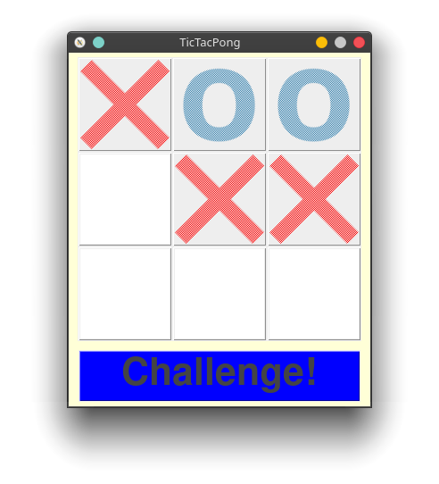
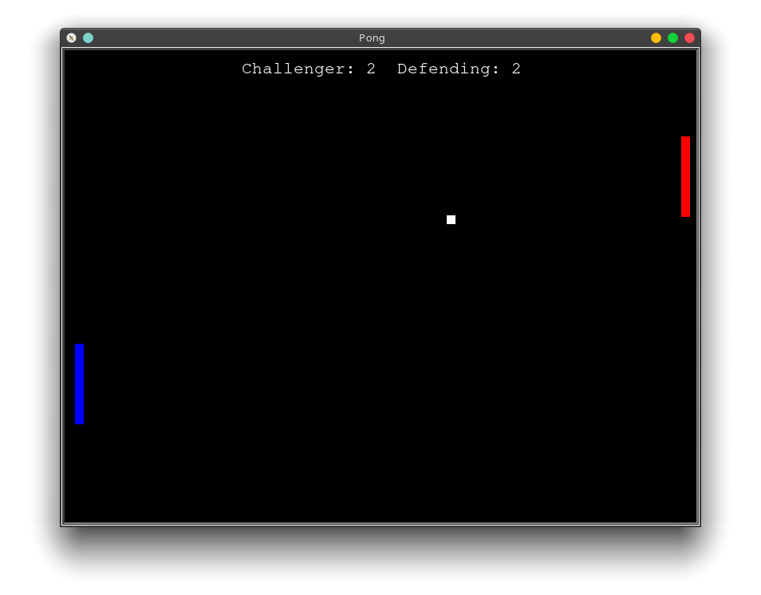

# TicTacPong
TicTacToe but players can challenge other players moves with a game of pong

## Rules:
* Just like regular game of TicTacToe, three in a row in any direction is a win for either player
* After a player moves the other player is allowed to challenge that move, players cannot challenge past moves.
* When the challenge button is pressed, a game of pong is started. If the challenger wins, they are able to take the spot and then move again, if they loose, they still retain their turn but must go somewhere else.

## Pictures:

## TODO:
- [x] Renamge TicTacToe window to TicTacPong
- [ ] Make it so players can only challenge a move once (challenge button disabled)
- [ ] Make it so a challenging player looses his turn if he looses the challenge
- [ ] Add a count down before the pong game starts
- [ ] Remove all print statements and replace then with popup windows
- [ ] Document code better
- [ ] Improve movement of pong paddles
